## :warning: Important :warning:
### This proyect was moved to [Gitlab](https://gitlab.com) here's only the README if you want to clone the repo follow the next link: https://gitlab.com/TitanHero/Dns-resolvercrypt

# Dns-resolvercrypt-english


Shell script programmed with gui (graphical user interface) to configure, modify, revise and route [dnsmasq](https://wiki.debian.org/HowTo/dnsmasq), [dnscrypt-proxy](https://www.dnscrypt.org/) and **resolv.conf** (see man page resolv.conf).


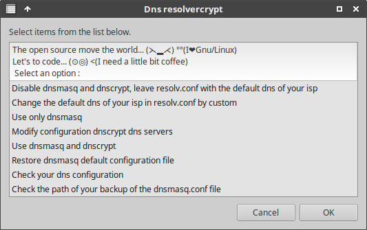


This script auto configures the routing of the **dnsmasq server** to the **dnscrypt-proxy server**, so that they are encrypted and proxyfied the Dns queries, in order to keep our browsing privacy safe, avoiding dns poisonings and\/or spying or tracking, as well as increasing our browsing speed and\/or saving data, by keeping previous dns queries in cache, avoiding doing new consultations, besides having other utilities and functions.


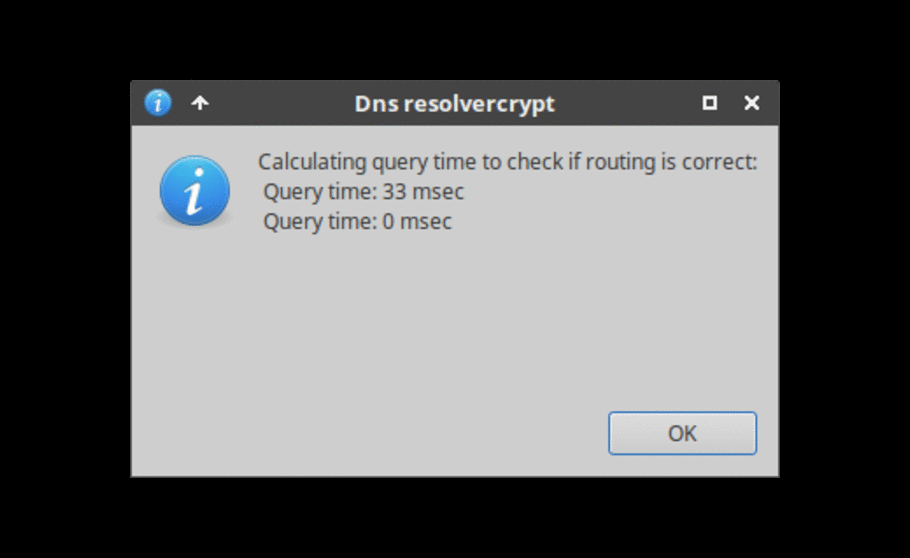


### This script depends on:


```
Zenity (zenity is default in ubuntu and flavors)

Dnsmasq

Dnscrypt-proxy
```


### To install it them we copy this command in terminal (console of commands) and we execute it:


 ```bash
 $ sudo apt update && sudo apt upgrade -y && sudo apt install zenity dnsmasq dnscrypt-proxy
 ```


This script takes **super user permissions** or use the **root account**, since it modifies and\/or configures system files, activates and deactivates services, without super user permissions some functions of this script may not work correctly.


Using this program is very easy, in command console we execute on the route where the script is located:


```bash
$ ./resolvercrypt.sh
```


### Important :warning:


In order to work encryption and proxy of dns queries it is necessary to have some data of the proxy server to which we are going to connect to validate it, these data are the **ip of the proxy server dns** to which [dnscrypt-proxy](https://www.dnscrypt.org/) is going to connect as well as the **name of the provider** and the **key of the proxy server dns**, here you can choose the one that you like more on [here](https://github.com/jedisct1/dnscrypt-proxy/blob/master/dnscrypt-resolvers.csv) or you can view your own list, you can see the default list that is in your distro **not recommended**, it may not be up to date, the path where it are is:

`/usr/share/dnscrypt-proxy/dnscrypt-resolvers.csv`


### By recommendation

`Before choosing a server is make ping queries to the server to verify the latency of response, this way we can choose the server that has less response time and consequently have faster dns queries.`

### How to use:

This script have 8 basic options, just choose the one you like, and follow the instructions in the script.

# The options


### Disable dnsmasq and dnscrypt, leave resolv.conf with the default dns of your isp:


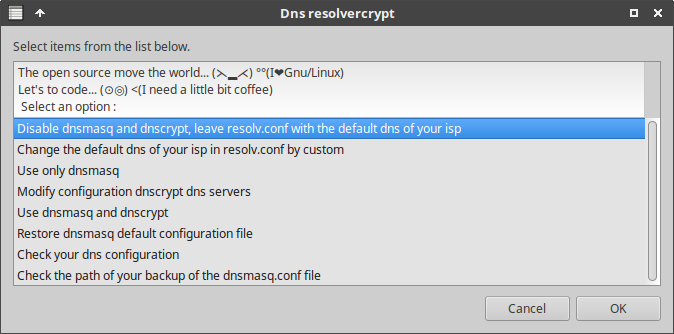


### Check the path of your backup of the dnsmasq.conf file:


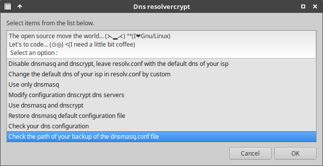

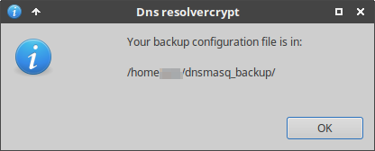

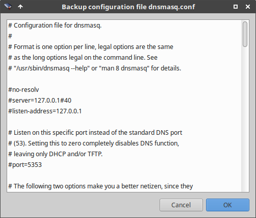


#### Change the default dns of your isp in resolv.conf by custom:


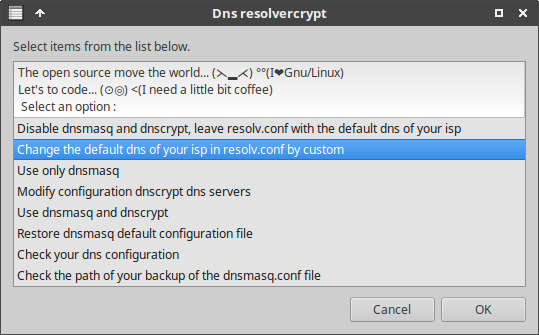

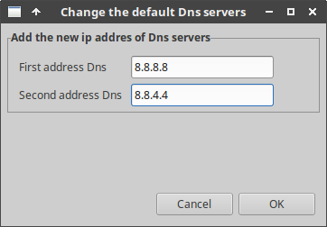


### Use only dnsmasq:


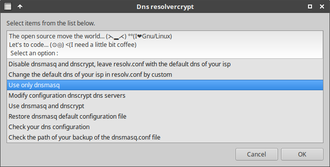

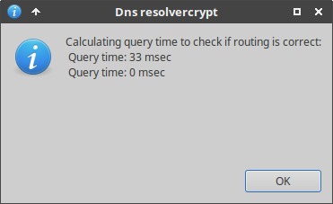

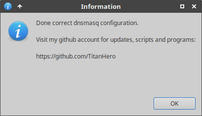


### Modify configuration dnscrypt dns servers:


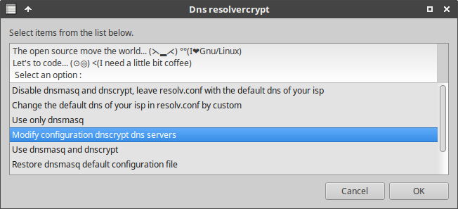

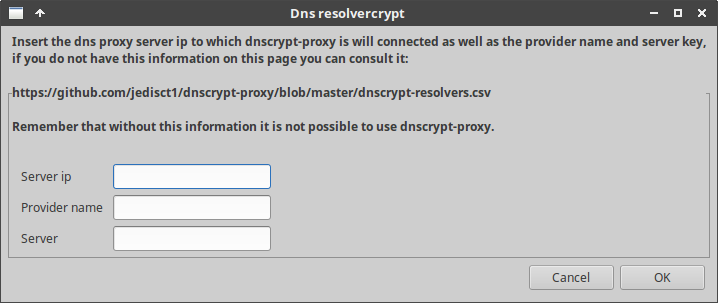


### Use dnsmasq and dnscrypt


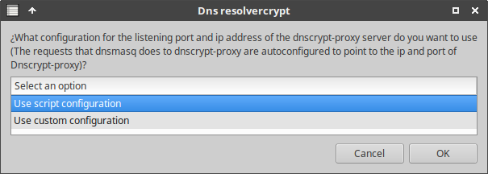

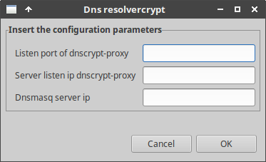


### Restore dnsmasq default configuration file


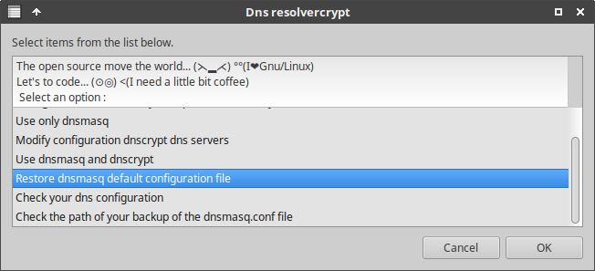


### Check your dns configuration

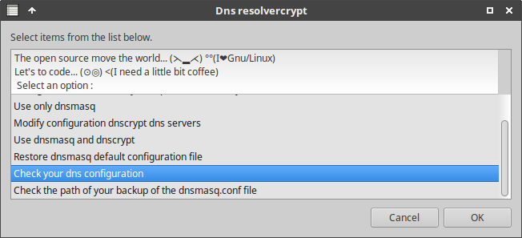


## License

[**GNU Affero General Public License v3.0**](LICENSE)
